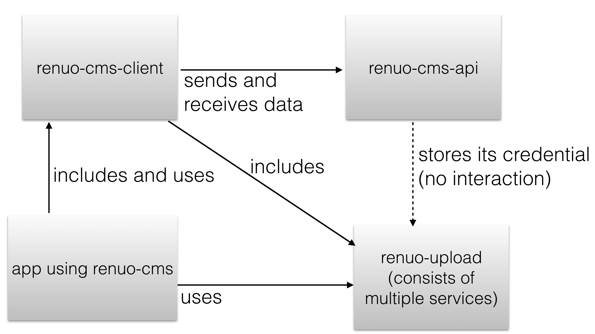

# Implementation

## Services

### renuo-cms-api

- stores content blocks with their contents
- stores renuo-cms credentials
- stores renuo-upload credentials
- updates and creates contentblocks and their contents
- creates renuo-cms credentials (renuo-upload credentials included)

### renuo-cms-client

- requests the content block contents from the cms api
- posts content block changes to the cms api (only for admins)
- requests the renuo upload credentials from the cms api (only for admins)
- includes the renuo-upload (client) and feeds it with the credentials it got from the cms api

### renuo-upload (client)

- makes a request to the signing server to get the signed url for the upload
- uploads the files directly to s3
- returns the url of the cdn to the cms