# Local Setup

For developing you want to set up the renuo-cms and the renuo-upload locally. They must be set up once and can then be used by every application that uses one or both of those services.

## Step by Step Manual

### Install renuo-cms-api

Clone git repository and run bin/setup:

```
git clone git@github.com:renuo/renuo-cms-api.git
cd renuo-cms-api
bin/setup
```

If you already cloned the project, you can just pull the newest version and migrate the database.

### Install renuo-upload signing

Clone git repository and run bin/setup:

```
git clone git@github.com:renuo/renuo-upload-signing.git
cd renuo-upload-signing
bin/setup
```

If you already cloned the project, you can just pull the newest version and migrate the database.

### Set Up a Amazon S3 bucket

1.  Log in to amazon

1.  Navigate to S3 by clicking on the S3 icon:

   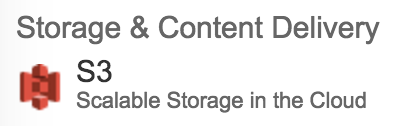

1.  Create new bucket by clicking on blue button on the top with text "create bucket":

    

1.  Name it however you like. We request to do something like ```renuo-upload-<yourname>-development``` and choose to place where your server should be. We usually use Frankfurt.

      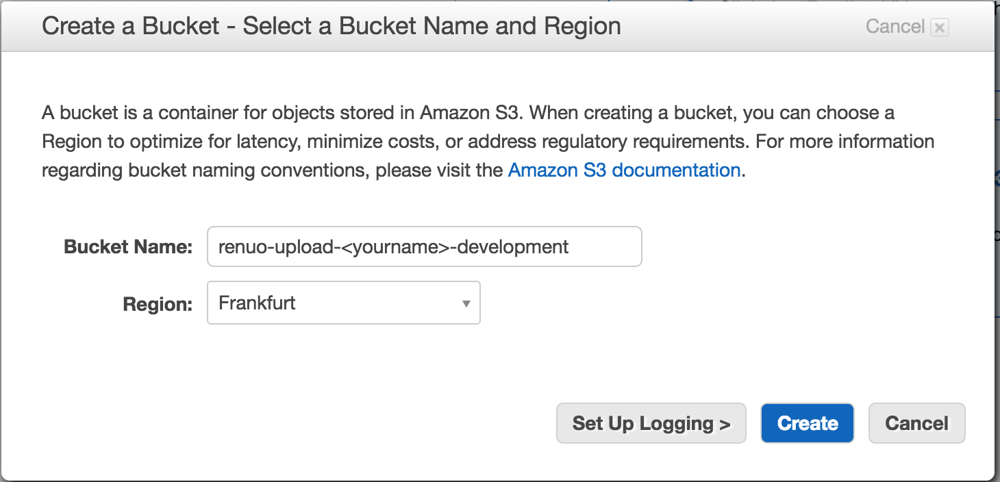

1.  Click on your project and navigate to Properties (right side of navigation). 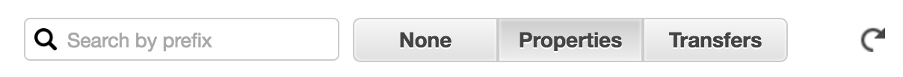 Click on the Permission section for folding it out and click on the butten called "Add CORS Configuration".

  Insert this:
```xml
<?xml version="1.0" encoding="UTF-8"?>
<CORSConfiguration xmlns="http://s3.amazonaws.com/doc/2006-03-01/">
    <CORSRule>
        <AllowedOrigin>*</AllowedOrigin>
        <AllowedMethod>GET</AllowedMethod>
        <AllowedMethod>POST</AllowedMethod>
        <MaxAgeSeconds>3000</MaxAgeSeconds>
        <AllowedHeader>*</AllowedHeader>
    </CORSRule>
</CORSConfiguration>
```
1.  Now click save, then close and after that the blue save button.

### Set UP Amazon IAM

1.  Log in to amazon if you aren't already because you just set up your s3 bucket.

1.  Navigate to IAM by clicking on the "Identity & Access Management" icon:

  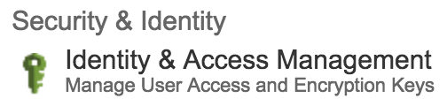

1.  Navigate to Users in the navigation on the left side.

  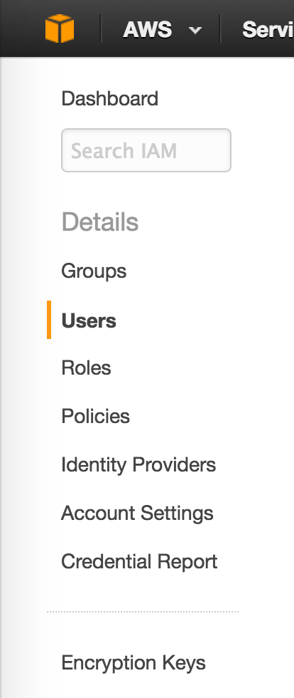

1.  Click on the blue button with a white "create new users"-writing:

  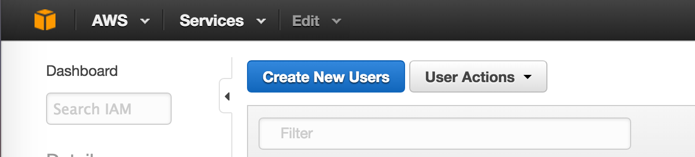

1.  Enter your name into the first field.

  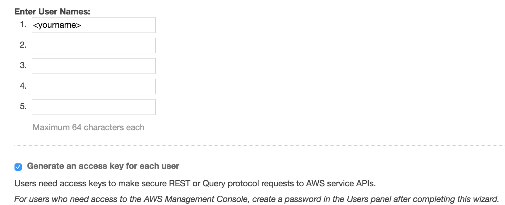

1.  Press "create" which you'll find in the lower right corner. It's blue with white writing:

  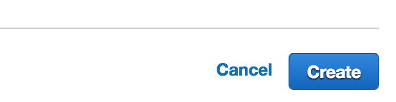

1.  Click on "Show User Security Credentials" and you see your needed keys. **IMPORTANT: **Download and store them in a secure place.

1.  Now click on your newly created IAM User and navigate to "Permissions". There you open the "Inline Policies" by clicking on the arrow beside it (if its not already opened)

  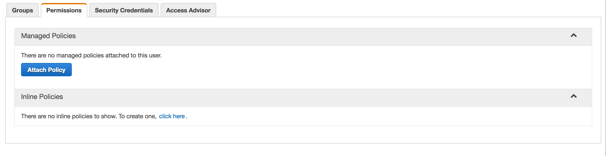
1.  Now click on the "click here" link in the "Inline Policies" section. 

1.  Choose "Custom Policy" and click select.

  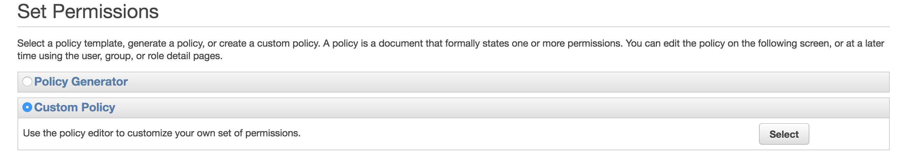

1.  Set the name of your Policy to something like: ```<yourname>-s3-policy```. 

1.  Insert this text to "Policy Document:
```json
{
  "Statement": [
    {
      "Action": [
        "s3:ListAllMyBuckets"
      ],
      "Effect": "Allow",
      "Resource": "arn:aws:s3:::*"
    },
    {
      "Action": "s3:*",
      "Effect": "Allow",
      "Resource": "arn:aws:s3:::<your-s3-bucket-name>"
    },
    {
      "Action": "s3:*",
      "Effect": "Allow",
      "Resource": "arn:aws:s3:::<your-s3-bucket-name>/*"
    }
  ]
}
```
It should look like this:

  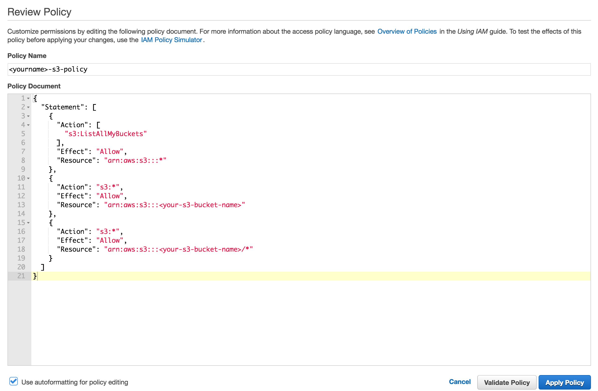

1.  Click on "Apply Policy"

### Configure renuo-upload-signing

Now you have to use the newly created bucket in your renuo-upload-signing by setting following keys in the *.env*-File:

-  **S3_BUCKET_NAME:** needs the name you gave to your bucket.
-  **CDN_HOST** differs if you changed the bucket-location for example. The part after the ```/``` will always be your bucket-name though.
-  **S3_PUBLIC_KEY** needs the "Access Key ID" which you downloaded before.
-  **S3_SECRET_KEY** needs the "Secret Access Key" which you downloaded before.

The *.env* file exists after running `bin/setup` as a copy of *example.env*. Adjust it:
-  ```S3_BUCKET_NAME``` needs the name you gave to your bucket.
-  ```CDN_HOST``` differs if you changed the bucket-location for example. The part after the ```/``` will always be your bucket-name though.
-  ```S3_PUBLIC_KEY``` needs the "Access Key ID" which you downloaded before.
-  ```S3_SECRET_KEY``` needs the "Secret Access Key" which you downloaded before.

Insert this into the file ```config/.env```. Make sure it's ignored by git.
```rb
S3_BUCKET_NAME: 'renuo-upload-<yourname>-development'
S3_PUBLIC_KEY: 'your public key found in Amazon IAM'
S3_SECRET_KEY: 'your secret key found in Amazon IAM'
CDN_HOST: 's3.eu-central-1.amazonaws.com/renuo-upload-<yourname>-development' #without https://, just the domain
```

### Set Up renuo-cms-demo as Example Project

1.  Clone it to your local machine:
```
git clone git@github.com:renuo/renuo-cms-demo.git
```
1.  Configure it in renuo-upload-signing by adding this line to the file ```config/.env```:
```rb
API_KEYS: {"key":"h8934hghd389g89fh98h","app_name":"renuo-cms-demo","env": "development"}
```

1.  Configure it in renuo-cms-api. Open the console with ```rails c``` and write:
```rb
CredentialPair.create(
 private_api_key: "47DTrw46jNDtt53g56Hg5MMt5",
 api_key: "T3i1A247Rd1",
 project_name: "renuo-cms-demo",
 renuo_upload_api_key: "h8934hghd389g89fh98h",
 renuo_upload_signing_url: "http://renuo-upload-signing.dev:3003/generate_policy"
)
```

1.  Navigate to the ```index.html``` of renuo-cms-demo and make a search/replace with:

  -  search for ```https://renuo-cms-api-demo.herokuapp.com/``` 
  -  replace with: ```//renuo-cms-api.dev:3002```

### Run All Applications

1.  Run renuo-upload-signing
```
bin/run
```

1.  Run renuo-cms-api
```
bin/run
```

1.  Run renuo-cms-demo. You can also run it with any server you like, as it is a static page. This is just an example:
```
cd page1
php -S renuo-cms-demo.dev:8080
```
For making this work add the line: ```127.0.0.1 renuo-cms-demo.dev``` to your ```/etc/hosts``` file.